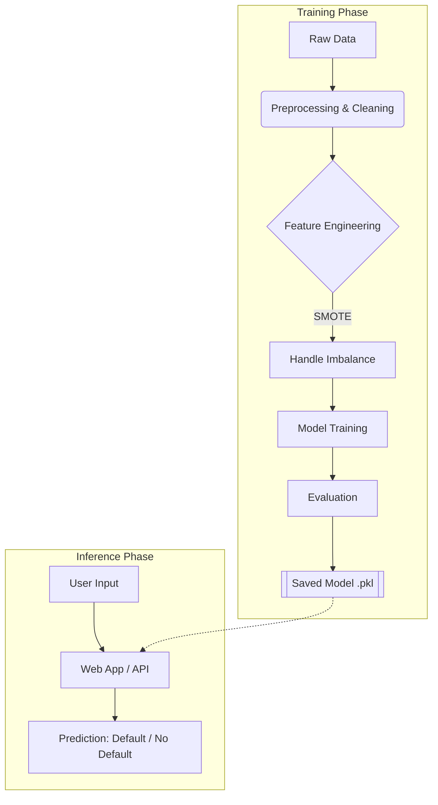

# 🏦 Loan Default Prediction

## 📖 Overview

This project utilizes machine learning techniques to predict the likelihood of a loan applicant defaulting on their repayment. By analyzing historical data—such as income, credit score, loan amount, and employment history—the system classifies applicants into **"Low Risk" (Repayment Likely)** or **"High Risk" (Default Likely)** categories.

The goal is to assist financial institutions in minimizing risk and automating the initial loan approval process.

-----

## 🏗️ System Architecture

The project follows a standard machine learning pipeline, divided into offline training and online inference.



-----

## 🛠️ Technologies Used

| Category | Tools |
| :--- | :--- |
| **Language** | Python 3.x |
| **Data Processing** | Pandas, NumPy |
| **Visualization** | Matplotlib, Seaborn |
| **Machine Learning** | Scikit-Learn, XGBoost/RandomForest |
| **Imbalance Handling** | SMOTE (Imbalanced-learn) |
| **Deployment** | Flask / Streamlit (Optional) |

-----

## 📊 Dataset & Features

The model is trained on historical loan data containing the following key features:

  * **Demographic:** Age, Employment Length, Home Ownership status.
  * **Financial:** Annual Income, Debt-to-Income (DTI) ratio.
  * **Loan Details:** Loan Amount, Interest Rate, Loan Term.
  * **Credit History:** Credit Score, Number of open credit lines, Past delinquencies.

> **Note:** Data preprocessing steps include missing value imputation, one-hot encoding for categorical variables, and standard scaling for numerical features.

-----

## 🚀 Installation & Setup

Follow these steps to set up the project locally:

### 1\. Clone the Repository

```bash
git clone https://github.com/jaeckanaquth/Loan-Default-Prediction.git
cd Loan-Default-Prediction
```

### 2\. Create a Virtual Environment (Optional but Recommended)

```bash
python -m venv venv
source venv/bin/activate  # On Windows use `venv\Scripts\activate`
```

### 3\. Install Dependencies

```bash
pip install -r requirements.txt
```

-----

## 💻 Usage

### Running the Analysis

To view the Exploratory Data Analysis (EDA) and model training steps, open the Jupyter Notebook:

```bash
jupyter notebook notebooks/Loan_Prediction_Analysis.ipynb
```

### Running the Application (If applicable)

If the project includes a web interface (e.g., Streamlit or Flask):

```bash
streamlit run app.py
# OR
python app.py
```

-----

## 📈 Model Performance

We evaluated several models to find the best balance between precision and recall.

| Model | Accuracy | Precision | Recall | F1-Score |
| :--- | :--- | :--- | :--- | :--- |
| Logistic Regression | 85% | 0.82 | 0.76 | 0.79 |
| **Random Forest** | **92%** | **0.89** | **0.85** | **0.87** |
| XGBoost | 91% | 0.88 | 0.84 | 0.86 |

*Since loan default is an imbalanced problem, we prioritized **Recall** to minimize False Negatives (predicting "Safe" when the user actually defaults).*

-----

## 🔮 Future Improvements

  * [ ] Deploy the API to a cloud provider (AWS/Heroku).
  * [ ] Intearate Explainable AI (SHAP) to show *why* a loan was rejected.
  * [ ] Add real-time data fetching capabilities.

-----

## 🤝 Contributing

Contributions are welcome\! Please open an issue or submit a pull request for any improvements.

-----

## 📝 Notes

- Model files (`.pkl`) are not included in the repository due to size limitations
- Train the model locally using the notebook or training script
- The model will be saved to `src/models/model_rf.pkl` after training
- See the notebook for detailed EDA and model development process