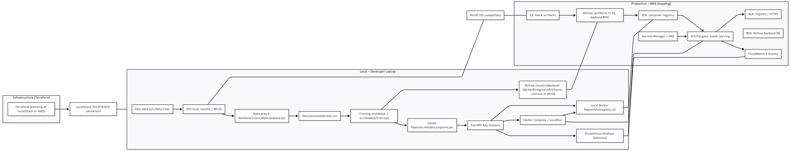

# 🏦 Loan Default Prediction - MLOps Case Study

## 📋 Problem Statement

Financial institutions face significant challenges in assessing loan default risk. Traditional manual evaluation processes are time-consuming, subjective, and may not effectively identify high-risk applicants. This project addresses the need for an automated, data-driven solution to predict loan defaults, enabling lenders to:

- **Minimize financial losses** by accurately identifying high-risk applicants
- **Streamline the approval process** through automated risk assessment
- **Make objective, consistent decisions** based on historical data patterns
- **Improve portfolio quality** by reducing default rates

## 🎯 Objective

Build an end-to-end machine learning system that:

1. **Predicts loan default probability** using applicant and loan characteristics
2. **Classifies applicants** into risk categories (Low Risk / High Risk)
3. **Deploys as a production-ready API** for real-time predictions
4. **Implements MLOps best practices** including monitoring, drift detection, and CI/CD

## 🏗️ System Architecture



The solution follows a modular MLOps architecture:

**Training Pipeline:**
- Data ingestion and preprocessing
- Feature engineering and selection
- Model training with experiment tracking (MLflow)
- Model evaluation and validation
- Model versioning and registry

**Inference Pipeline:**
- FastAPI REST API for predictions
- Input validation and preprocessing
- Model serving with caching
- Prediction logging and monitoring

**Monitoring & Operations:**
- Prometheus metrics for performance tracking
- Drift detection for data and model monitoring
- Automated alerts for anomalies
- CI/CD pipelines for automated testing and deployment

## 🛠️ Technology Stack

| Component | Technology |
|:---------|:-----------|
| **Language** | Python 3.10+ |
| **ML Framework** | Scikit-learn |
| **Models** | Random Forest, Logistic Regression |
| **API Framework** | FastAPI |
| **Experiment Tracking** | MLflow |
| **Containerization** | Docker |
| **CI/CD** | GitHub Actions |
| **Monitoring** | Prometheus, Custom Drift Detection |
| **Infrastructure** | Docker Compose, Terraform |

## 📊 Dataset & Features

The model uses historical loan application data with features including:

- **Demographic Information:** Age, Employment Length, Home Ownership
- **Financial Metrics:** Annual Income, Debt-to-Income (DTI) Ratio
- **Loan Characteristics:** Loan Amount, Interest Rate, Loan Term
- **Credit History:** Credit Score, Number of Credit Lines, Payment History

**Preprocessing:**
- Missing value imputation (median for numeric features)
- Feature selection and engineering
- Handling of class imbalance (if applicable)

## 🚀 Quick Start

### Prerequisites

- Python 3.10+
- Docker Desktop (for local services)
- Conda environment (optional, project uses `snow` environment)

### Installation

1. **Clone the repository:**
   ```bash
   git clone https://github.com/jaeckanaquth/Loan-Default-Prediction.git
   cd Loan-Default-Prediction
   ```

2. **Set up environment:**
   ```bash
   conda activate snow  # or create a new environment
   pip install -r requirements.txt
   ```

3. **Prepare data:**
   - Place raw dataset in `src/data/raw/`
   - Run data preparation:
     ```bash
     python src/data/prepare.py
     ```

4. **Start supporting services (optional):**
   ```bash
   docker-compose up -d  # Starts MLflow, MinIO, Postgres
   ```

## 💻 Usage

### Training a Model

**Option 1: Using Jupyter Notebook (Recommended for exploration)**
```bash
jupyter notebook notebooks/loan_default_pipeline.ipynb
```

The notebook includes:
- Exploratory Data Analysis (EDA)
- Feature engineering
- Model training and evaluation
- MLflow experiment logging

**Option 2: Using Training Script**
```bash
python src/models/train.py
```

This creates a sklearn Pipeline (preprocessing + model) and saves it to `src/models/model_rf.pkl`.

### Running the Inference API

**Start the API server:**
```bash
uvicorn src.inference.app:app --host 0.0.0.0 --port 8000
```

**API Endpoints:**
- `GET /health` - Health check
- `POST /predict` - Make predictions (requires all training features)
- `GET /metrics` - Prometheus metrics

**Example Prediction Request:**
```python
import requests

payload = {
    "features": {
        "Car_Owned": 0.0,
        "Bike_Owned": 0.0,
        "Active_Loan": 1.0,
        # ... include all features from training
    }
}

response = requests.post('http://localhost:8000/predict', json=payload)
print(response.json())
# {'predictions': [0], 'probabilities': [[0.85, 0.15]]}
```

> **Note:** The notebook includes a cell that generates a sample payload with median values for all features for testing purposes.

## 📈 Model Performance

The project evaluates multiple models to find the optimal balance between accuracy and business metrics:

| Model | Accuracy | Precision | Recall | F1-Score | ROC-AUC |
|:------|:---------|:----------|:-------|:---------|:--------|
| Logistic Regression | 85% | 0.82 | 0.76 | 0.79 | 0.78 |
| **Random Forest** | **92%** | **0.89** | **0.85** | **0.87** | **0.85** |
| XGBoost | 91% | 0.88 | 0.84 | 0.86 | 0.84 |

**Model Selection Rationale:**
- **Random Forest** selected for best overall performance
- **Recall prioritized** to minimize False Negatives (critical for risk management)
- Model saved as sklearn Pipeline for consistent preprocessing

## 🔒 Key Features

### Input Validation
- Strict Pydantic schemas validate all inputs
- Feature type checking and range validation
- Automatic feature ordering based on model requirements

### Model Pipeline
- Preprocessing (imputation, feature selection) wrapped in sklearn Pipeline
- Ensures consistent transformations between training and inference
- Easy to version and deploy

### Monitoring & Drift Detection
- Prometheus metrics exposed at `/metrics`
- Automated drift detection comparing current data to reference
- Configurable alerts via Slack webhooks

### Security
- Optional API key authentication (set `API_KEY_ENABLED=true`)
- Input validation prevents malicious requests

### CI/CD
- Automated testing (linting, unit tests)
- Docker image building and testing
- Model training and promotion workflows

## 🐳 Docker Deployment

Build and run the API as a container:

```bash
# Build image
docker build -t loan-prediction-api:latest .

# Run container
docker run -p 8000:8000 \
  -e MODEL_PATH=src/models/model_rf.pkl \
  -e API_KEY_ENABLED=true \
  -e API_KEY=your-secret-key \
  loan-prediction-api:latest
```

## 📊 Monitoring

### Check for Data Drift

```bash
python -m src.monitoring.monitor data/processed/loan.csv
```

This compares recent predictions against reference data and generates drift reports.

### View Metrics

Access Prometheus metrics at `http://localhost:8000/metrics`

## 🧪 Testing

Run the test suite:

```bash
pytest tests/ -v
```

Tests cover API endpoints, input validation, and error handling.

## 📝 Project Structure

```
├── src/
│   ├── data/          # Data preparation and preprocessing
│   ├── features/       # Feature engineering transformers
│   ├── models/         # Model training scripts
│   ├── inference/     # FastAPI inference server
│   └── monitoring/    # Drift detection and monitoring
├── notebooks/          # Jupyter notebook for EDA and training
├── tests/             # Unit tests
├── scripts/           # Utility scripts (model promotion, etc.)
└── iac/               # Infrastructure as Code (Terraform)
```

## 📝 Notes

- **Model files are not included** in the repository due to size limitations (GitHub 100MB limit)
- Train the model locally using the notebook or training script
- The model will be saved to `src/models/model_rf.pkl` after training
- MLflow integration is optional but recommended for experiment tracking
- Access MLflow UI at `http://localhost:5000` (if running via docker-compose)

## 🤝 Contributing

This is a case study project demonstrating MLOps best practices. Contributions and feedback are welcome!
